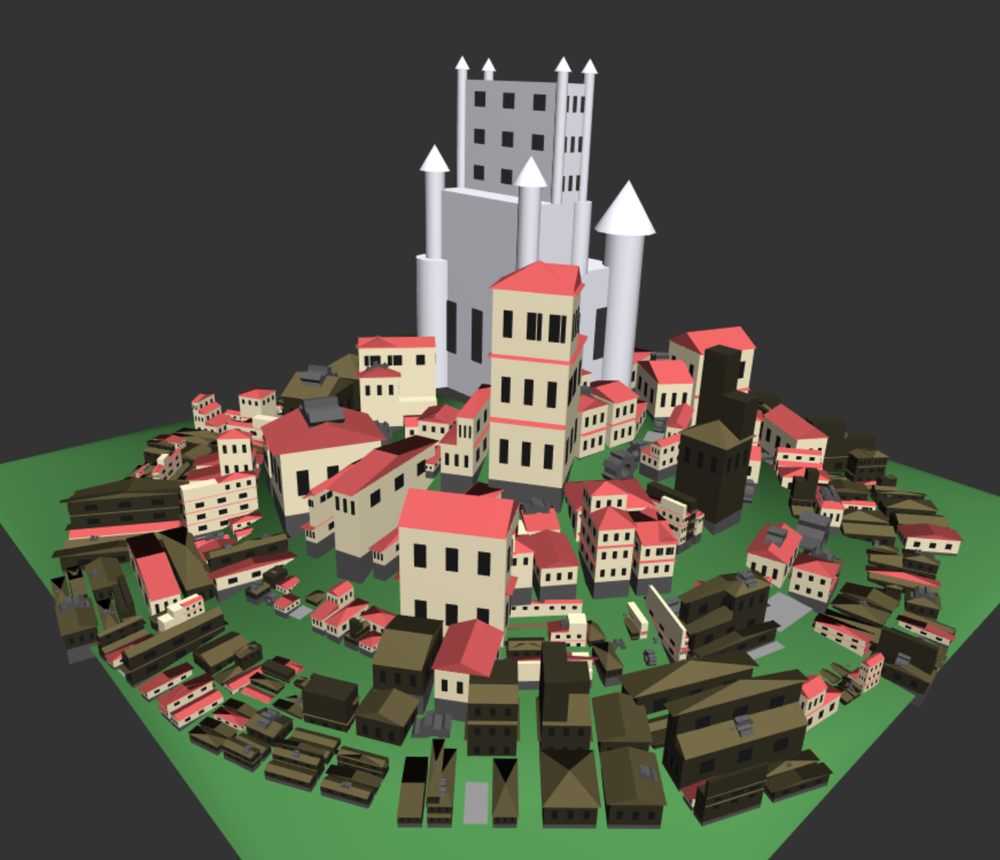
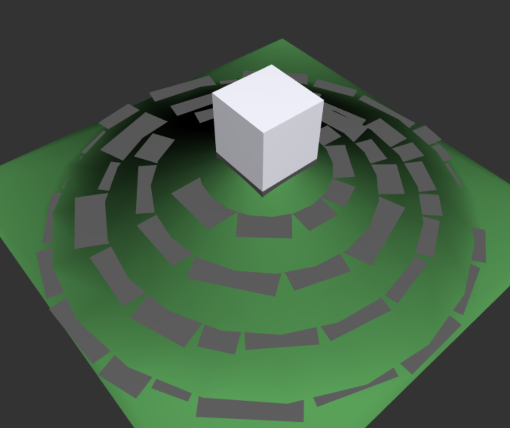
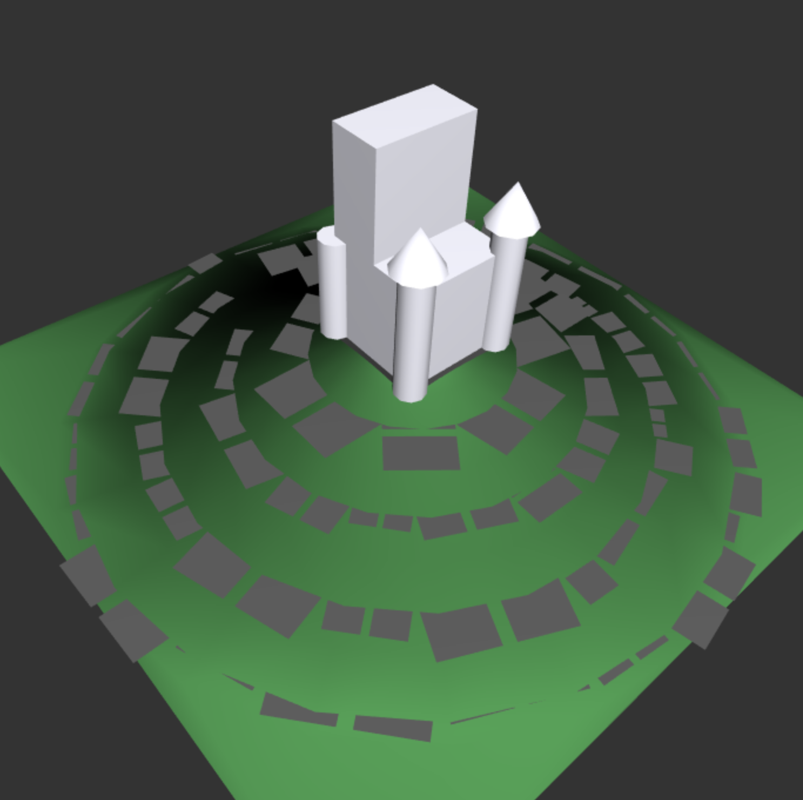
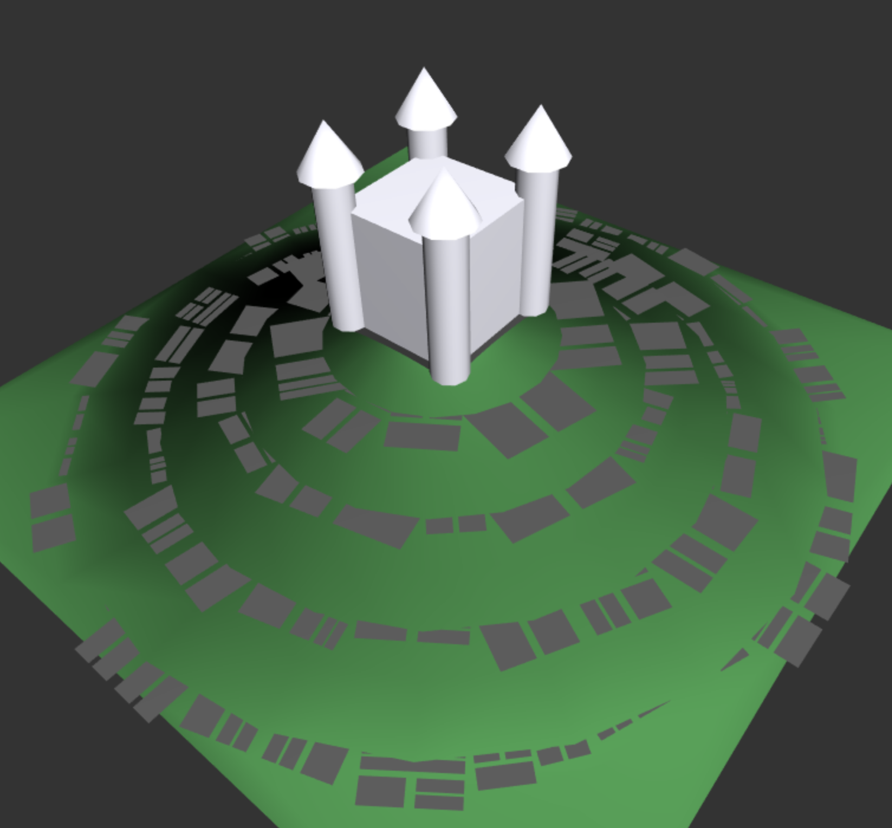
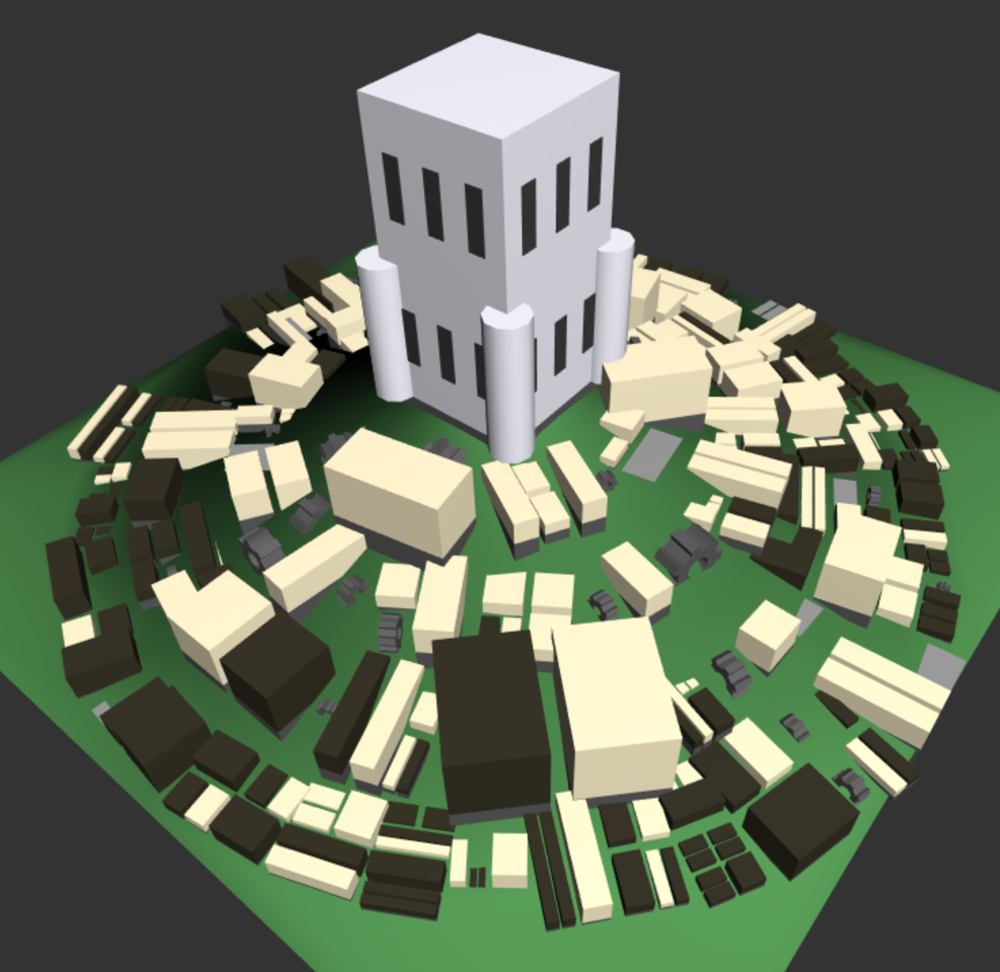
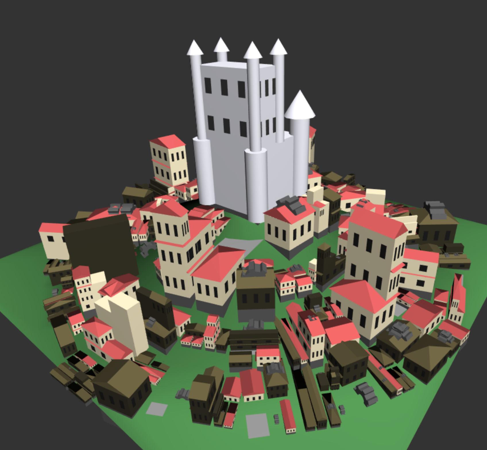

# Project 5: Shape Grammar - Castle Town
By Joshua Nadel

## Generation

The castle town begins generation by placing basic hill terrain with a castle block at its center. Lots are randomly distributed accross different radii with random angles. Lots are recorded as either wider than they are long or longer than they are wide upon generation.

Iteration begins by selecting certain lots and dividing them in half. Because the shape grammar knows if a lot is longer than it is wide or wider than it is long, it can cut the lots down their shorter axis to avoid creating unusually long buildings. This only applies on the first iteration, but the distinction has a great impact on the final result. Lots further away from the center are more likely to be divided, making the buildings on the outskirts of the city generally smaller. Meanwhile, the castle is free to generate towers, windows, and more stories.

As iteration continues, interesting lot shapes emerge.

At the fith iteration, the grammar stops dividing the lots and places buildings in each one. Each building has a foundation shape beneath it to ensure that it doesn't float above the variable terrain. Brown buildings are more likely to generate towards the outskirts of the city, while beige ones favor the center.

At the tenth iteration, the city is considered complete. Buildings have generated roofs, windows, and additional stories. Beige buildings generate red roofs, and brown buildings generate brown roofs. Some of the buildings have become cogs (or have cogs attached to them), while others have become flat lots and town squares. The castle rises above the city, tall and proud.

## Inspiration
The initial theme was inspired by Game of Thrones. I was interested in emulating the clockwork cities in the opening cinematic. The colors call to mind those found in the show's "King's Landing" setting.